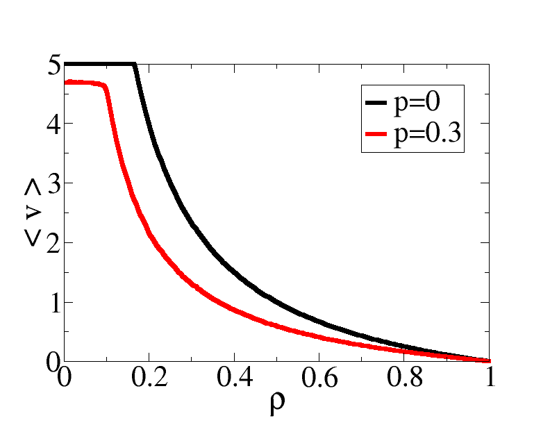
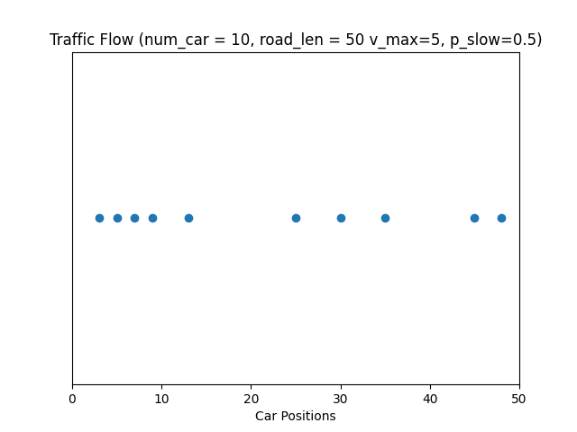

  <h1 style="margin:0; padding:0;">Traffic Flow Simulation Using the NaSch Model</h1>

We will conduct an analysis of traffic build-up dependence on car density using the Nagel–Schreckenberg traffic CA model. Below are the details of the analysis and further information regarding the implementation of potential solutions.

## **The Nagel–Schreckenberg Model:**

The model is a cellular automaton model for road traffic flow that can reproduce traffic jams, like those of real life. The model uses periodic boundary conditions (a row of cells that loops back to itself) and car object parameters (cell occupation and velocity) to represent or reproduce interactions. Below are the behaviors (in specific order) of the cars.

## **Rules for the Model:**

1. Cars not at maximum velocity will increase their velocity by one unit. The range for the original model was from 0 to 5.

2. Cars will slow down if a vehicle is in front of them if the number of cells for the distance between cars is smaller than their current velocity. If true, the velocity will adjust to the number of empty cells in front of the vehicle to avoid a collision.

3. Cars with a velocity of at least 1 will randomly decrease their velocity by 1 unit in accordance with a probability. The probability is denoted as p and can be set, for example, to 0.5.

4. Finally, cars will move forward the number of cells that is equal to their velocity.

 

## **Nagel–Schreckenberg Model (Avg. Velocity vs Density)**

  

  <strong>Figure 1:</strong> Shown above is the average vehicle velocity as a function of traffic density.
  Note that changes in randomness (p) result in alterations to the decay rate characteristics and initial average velocity. As shown, as p increases, the decay rate proportionally increases and the initial average velocity decreases.

Source: https://en.wikipedia.org/wiki/Nagel%E2%80%93Schreckenberg_model

 

## **Traffic Flow Animation**

- The variable "num_car" for the number of cars on the road. 
- The variable "road_len" for the length of the road. *road_len >= num_car*
- The variable "v_max" for the maximum velocity (Rule #1).
- The variable "p_slow" for the probability of cars slowing down (Rule #3).

  

### Here is another simulation modeling the phantom traffic jam.

  

 

## **Code Plan:**
- Write/code model to develop math behind car density to traffic function
- Write/code to model the proportionality between density, time and other factors compared to the traffic build up
- Calculate the time it takes for one car to get to point A to point B (transverse a set period in space)
- Build(in python) graphs to simulate different traffic jam scenarios
- With any extra time, we will propose a solution to these traffic jams (civil engineering approach)
- With any extra extra time, we will try to code a mathematical simulation of this new proposal

## **Contributions:**
- Laila: Help build visuals and write descriptions for different sections and present final project
- Cosmo: Create graphs to simulate different traffic jam scenarios / Code the proportionality between density, time, and other factors compared to the traffic build up.
- Charles: Provide potential solutions to traffic jams (civil engineering)
- Juan: Write/code model to develop math behind car density to traffic function
- Everyone: come up with potential switches to the code to get less traffic

## **Developmental Notes:**

Planned directory structure: Results folder, Date folder

Potential packages to use: Numpy, math, random, matplotlib

## **References:**
Theory Reference - https://www.thp.uni-koeln.de/~as/Mypage/traffic.html
 Potential Data Source - https://www.kaggle.com/datasets
